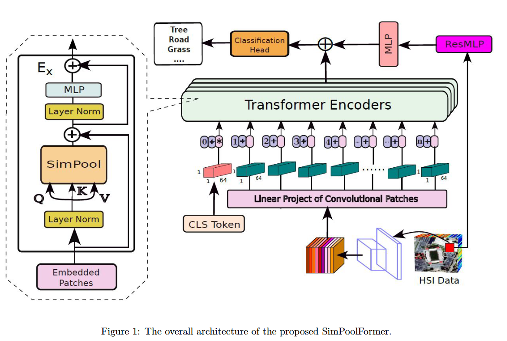

# SimPoolFormer: A two-stream vision transformer for hyperspectral image classification☆

[Swalpa Kumar Roy](https://swalpa.github.io), [Ali Jamali](https://www.researchgate.net/profile/Ali-Jamali), [Jocelyn Chanussot](https://jocelyn-chanussot.net/), [Pedram Ghamisi](https://www.iarai.ac.at/people/pedramghamisi/), Ebrahim Ghaderpour, and Himan Shahabi

___________

Citation
---------------------

**Please kindly cite the paper if this code is useful and helpful for your research.**

       @article{ROY2025101478,
               title = {SimPoolFormer: A two-stream vision transformer for hyperspectral image classification},
               author = {Ali Jamali and Swalpa Kumar Roy and Leila Hashemi Beni and Biswajeet Pradhan and Jonathan Li and Pedram Ghamisi},
               journal = {Remote Sensing Applications: Society and Environment},
               pages = {101478},
               year = {2025},
               issn = {2352-9385},
               doi = {https://doi.org/10.1016/j.rsase.2025.101478},
               url = {https://www.sciencedirect.com/science/article/pii/S235293852500031X},
              }

Acknowledgement
---------------------
SimPool is adopted from (https://github.com/billpsomas/simpool).

## License

Copyright (c) 2025 Ali Jamali. Released under the MIT License. See [LICENSE](LICENSE) for details.
